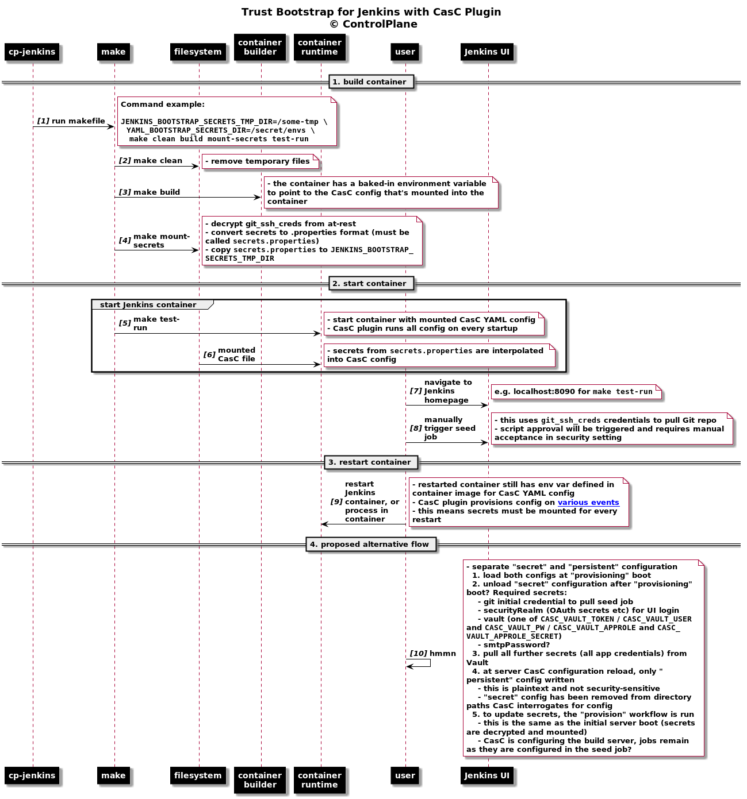
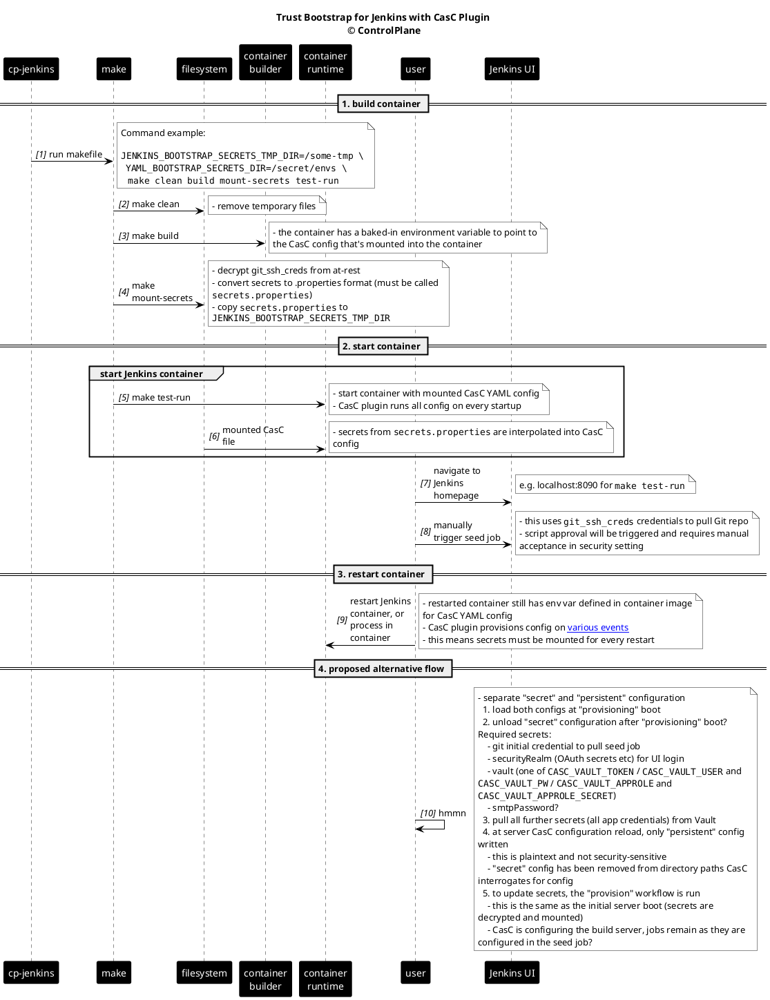

# Jenkins

<!-- toc -->

- [Diagram](#diagram)

<!-- tocstop -->

CasC trust bootstrap starts, reloads, and reconfigures a Jenkins master from scratch. The problem is the secrets must be available in plaintext on the filesystem (in a secrets.properties) for CasC to load them, and when the CasC plugin reloads configuration (which might happen after a plugin update) it tries to rewrite the whole config (and if the plaintext secrets are gone, the Jenkins secrets get "blanked")

Bootstrapping app secrets from Vault requires one of `CASC_VAULT_TOKEN` / `CASC_VAULT_USER` and `CASC_VAULT_PW` / `CASC_VAULT_APPROLE` and `CASC_VAULT_APPROLE_SECRET`, so they need to be injected somehow. Other system secrets (not credentials, general Jenkins secrets) include git init credential, securityRealm (OAuth secrets etc), smtpPassword

My current thinking is to separate the "secret" and "persistent" Jenkins CasC config and merge them in entrypoint magic, then use the Makefile invocation to remove the secrets.properties from the temp filesystem they're mounted into the container on. Any and all thoughts welcome, I'll persevere with this approach for now.

When this is in K8s I don't know how we'll clean up the plaintext secrets yet. Perhaps copying across a shared volume, initContainer magic...urggh.

(The previous way of doing this trust bootstrap in cp-jenkins was to manually set those secrets)

## Diagram

Diagram Source

